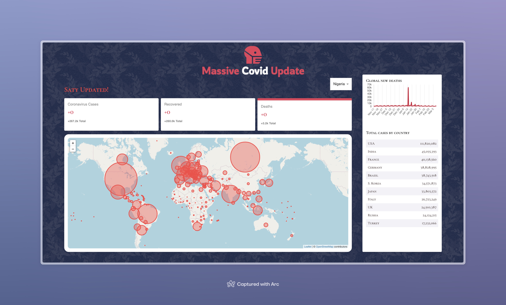

# Massive Covid Update

## Overview
This project is a React-based web application that provides real-time statistics and visualizations of COVID-19 data globally and by country. It features a dynamic map, statistical graphs, and a table detailing cases by country.



## Features
- **Global and Country Specific Data**: Displays COVID-19 statistics such as total cases, recoveries, and deaths both worldwide and for selected countries.
- **Interactive Map**: Shows data distribution geographically, allowing users to visualize the impact across different regions.
- **Graphical Representations**: Line graphs to track the number of new cases over time.
- **Sortable Table**: Lists countries with their respective case counts, sortable by the number of cases.

## Technologies Used
- React.js
- Material-UI
- Leaflet (for the map)
- Chart.js (for line graphs)
- Numeral.js (for formatting numbers)

## Setup
To run this project locally, follow these steps:

1. Clone the repository:
   ```bash
   git clone https://github.com/bensontamunoemi/Massive-Covid-Update.git
   ```
2. Navigate to the project directory:
   ```bash
   cd massive-covid-update
   ```
3. Install dependencies:
   ```bash
   npm install
   ```
4. Start the development server:
   ```bash
   npm start
   ```

## Usage
Upon launching the application, users can:
- Select a country from the dropdown menu to view specific data.
- Click on different tabs to switch between cases, recoveries, and deaths.
- Hover over the map to see detailed statistics for each country.

## Contributing
Contributions to this project are welcome. Please fork the repository and submit a pull request with your features or fixes.


